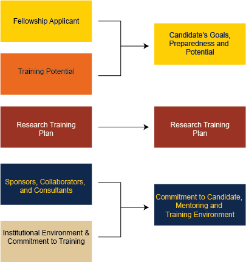

# Comparing and Contrasting the Old and New PAs for F31

As of June 14th, 2025 there is a new PAF for F31.

* Old PAF https://grants.nih.gov/grants/guide/pa-files/PA-23-272.html
* New PAF https://grants.nih.gov/grants/guide/pa-files/PA-25-422.htm

## Review Criteria

The major change is going from **five** to **three** scored review criteria:

* Candidate's Goals, Preparedness and Potential (Previously two sections, Fellowship Applicant and Training Potential)
* Research Training Plan still present
* Commitment to Candidate, Mentoring and Training Environment (previously two sections, Sponsors, Collaborators, and Consultants and Institutional Environment & Commitment to Training)

The specfic changes in the review criteria, and my best guess on how they are in alignment with the prior criteria are below:

| **New F31 (PA-25-422)** | **Prior F31 (PA-23-272)**  |
|-----|------|
 **Candidate's Goals, Preparedness and Potential**  | |  
| Discuss the candidate's previous educational, scientific and professional experience in terms of how it prepares the candidate for the proposed research training plan. Consider the context, for example, the candidate's stage of training and the opportunities available.| * Are the candidate's academic record and research experience of high quality? * Is the research project consistent with the candidate’s stage of research development? * Does the proposed training have the potential to serve as a sound foundation that will clearly enhance the candidate’s ability to develop into a productive researcher? |  
| Assess whether the candidate and sponsor statements as well as the referee letters provide convincing evidence that the candidate posesses qualities (such as scientific understanding, creativity, curiosity, resourcefulness and drive) that will improve the likelihood of a successful research training outcome. | * Does the candidate have the potential to develop into an independent and productive researcher? |
| Consider the candidate's potential to benefit from the fellowship research training plan and to transition to the next career stage in the biomedical research workforce. | * Does the candidate demonstrate commitment to a research career in the future? | 
| **Research Training Plan** ||
| Assess the rigor and feasibility of the research training project and how completion of the project will contribute to the development of the candidate as a research scientist. | * Is the proposed research project of high scientific quality, and is it well integrated with the proposed research training plan? * Is the prior research that serves as the key support for the proposed project rigorous? * Has the applicant included plans to address weaknesses in the rigor of prior research that serves as the key support for the proposed project? * Has the applicant presented strategies to ensure a robust and unbiased approach, as appropriate for the work proposed? |
| Evaluate the goals of the overall research training plan and the extent to which the plan will facilitate the attainment of the goals. | * Are the proposed research project and training plan likely to provide the candidate with the requisite individualized and mentored experiences in order to obtain appropriate skills for a research career? |
| Discuss whether the research training plan identifies areas of needed development and contains appropriate, realistic activities and milestones to address those needs. | * Does the training plan take advantage of the candidate’s strengths and address gaps in needed skills? Does the training plan document a clear need for, and value of, the proposed training? *  Is the proposed time frame feasible to accomplish the proposed training? |
| Consider whether the sponsor(s), scientific environment, facilities and resources are adequate and appropriate for the proposed research training plan. | * Are the research facilities, resources (e.g., equipment, laboratory space, computer time, subject populations, clinical training settings) and training opportunities (e.g. seminars, workshops, professional development opportunities) adequate and appropriate? *Is the institutional environment for the candidate’s scientific development of high quality? | 
| *(Clinical trials only)* If the candidate is proposing to gain experience in a clinical trial as part of his or her research training, is there evidence of the appropriate expertise, experience, resources, and ability on the part of the sponsor(s) to guide the applicant during the clinical trial research experience? | * If proposed, will the clinical trial experience contribute to the proposed project and/or the applicant’s research training? |
| **Commitment to Candidate, Mentoring and Training Environment** ||
| Assess whether the sponsor(s) presents a strong mentoring plan appropriate to the needs and goals of the candidate. | * Is there evidence of a match between the research and clinical interests (if applicable) of the candidate and the sponsor(s)? Do(es) the sponsor(s) demonstrate an understanding of the candidate’s training needs as well as the ability and commitment to assist in meeting these needs? * If a team of sponsors is proposed, is the team structure well justified for the mentored training plan, and are the roles of the individual members appropriate and clearly defined? |
| Evaluate the extent to which the sponsor(s) and organizational commitment is appropriate, sufficient and in alignment with the candidate's research training plan. | * Are the qualifications of any collaborator(s) and/or consultant(s), including their complementary expertise and previous experience in fostering the training of fellows, appropriate for the proposed project? |
| Consider whether the level of the commitment provided will contribute to the successful completion of the proposed plan and allow the candidate to advance to a productive career in the biomedical research workforce. | * Is there appropriate institutional commitment to fostering the candidate’s mentored training? * Are the sponsor(s ) research qualifications (including recent publications) and track record of mentoring individuals at a similar stage appropriate for the needs of the candidate?  * Does the sponsor's research and training record, as well as mentoring statement, indicate that the candidate will receive exceptional training in the proposed research area and have the opportunity to publish high quality papers and present research data at national meetings as the project progresses?|
| If proposed, will the clinical trial experience contribute to the proposed project and/of the candidate's research training? | *If the applicant is proposing to gain experience in a clinical trial as part of his or her research training, is there evidence of the appropriate expertise, experience, resources, and ability on the part of the sponsor(s) to guide the applicant during the clinical trial research experience? |

### Removed in Updated Program Announcement

* Has the applicant presented adequate plans to address relevant biological variables, such as sex, for studies in vertebrate animals or human subjects?
* Will the training plan provide the professional skills needed for the candidate to transition to the next stage of their research career?
* Does the training plan provide adequate opportunities to present and publish research findings and meet with scientists in the community at national meetings as the work progresses?
* Is there evidence of adequate research funds to support the candidate’s proposed research project and training for the duration of the research component of the fellowship?
