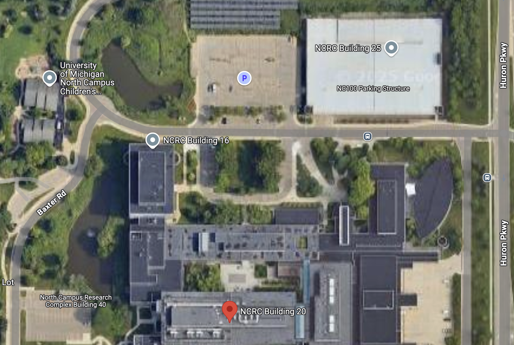

# Fellowship Writing Workshop

This site contains documents and information for a fellowship writing workshop sponsored by the [Elizabeth Weiser Caswell Diabetes Institute](https://diabetes.med.umich.edu/), first offered in Summer 2025.  If you are interested in joining the CDI Learning Community, or participating in this or future workshops please email us at [TrainingandMentoringAdmin@umich.edu ](mailto:TrainingandMentoringAdmin@umich.edu).

The main goal is to support trainees in writing F31 and F32 applications, so these materials are based on [PA-23-272](https://grants.nih.gov/grants/guide/pa-files/PA-23-272.html) and [PA-23-262](https://grants.nih.gov/grants/guide/pa-files/PA-23-262.html).

# Organization and Plan

We will host workshops every other week with a brief faculty talk followed by peer review of each other's documents.  We will meet *in person* from 11-12 at North Campus Research Center B20 Rm 2814:

## Workshop structure

* **Before the meeting**: First complete the worksheet for each week, then using that information write drafts of the relevant sections.  Upload these by Friday before the meeting.
* **During the workshops**: There will be a faculty-led mini-lecture on the topic, followed by peer review of each participant's documents (and food).
* **After the workshops**: Revise your documents based on the discussions.

## Schedule

The schedule is based on a presumed cycle 1 submission date of **August 8th, 2025**.

| Session | Date | 
| ------------- | ------------- |
| [Orientation and Planning](Timeline.md)  | May 16th |
| [Candidate Introduction](Candidate.md) and [Budget](Budget.md)| May 30th | 
| [Training Plan](Training_Plan.md) and [Sponsor's Statement](Sponsor_Statement.md) | June 11th | 
| [Aims Page and Abstract](Aims.md) |  June 27th | 
| [Supporting Documentation](Supporting_Documents) | July 11th |
| [Research Strategy](Research_Stragegy.md)| July 25th |

These materials are free for anyone to use without attribution and are provided under a [CC-0 License](LICENSE.md)

# Other Resources

* Program Announcement for predoctoral awards [NIH NRSA F31](https://grants.nih.gov/grants/guide/pa-files/PA-23-272.html).
* Program Announcement for postdoctoral awards [NIH NRSA F32](https://grants.nih.gov/grants/guide/pa-files/PA-23-262.html).
* Arjun Raj's excellent ["So you want to apply for a PhD fellowship?"](https://docs.google.com/document/d/1WTMW3LZl1ifpFE1ddH1lvfijmmMsFwZggwsuQcotV_A/edit).

